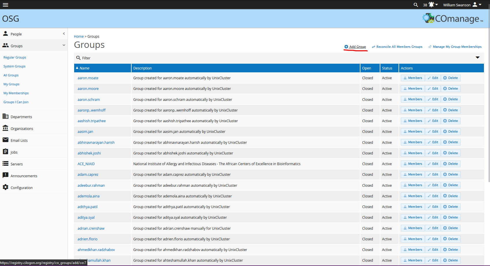
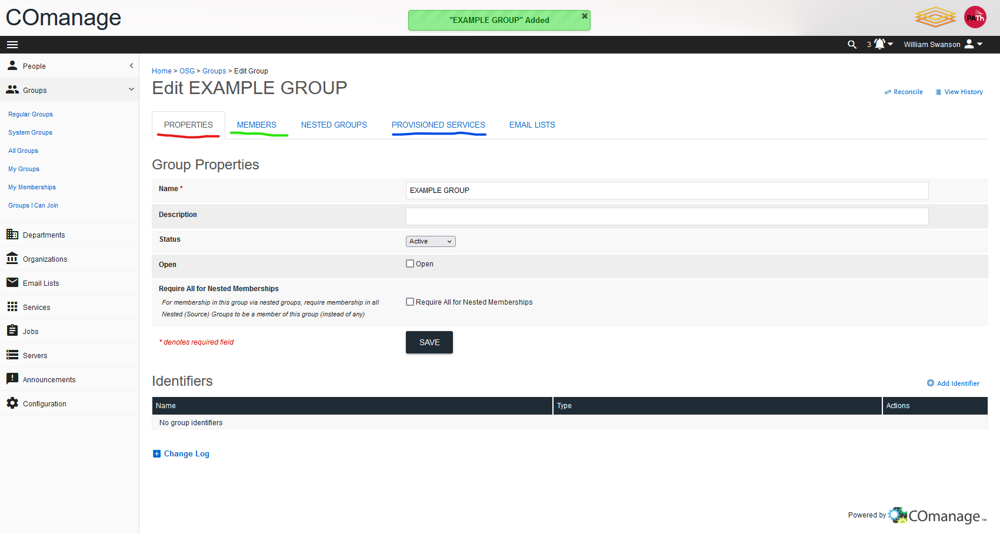
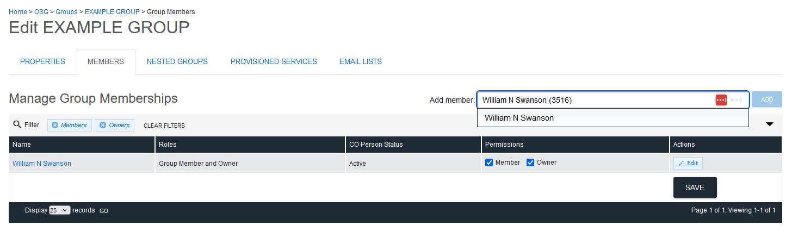
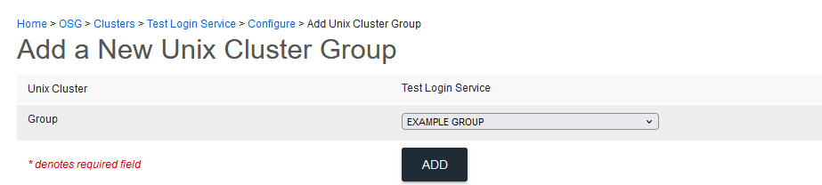

COmanage Recipes
================

A collection of step-by-step instructions for OSG COmanage administrators.

### Provisioning a CO Group in COManage

In order for a CO Group from COManage to show up in LDAP (and thus be made available for reference on hosts),
it must first be provisioned.

Follow these steps to provision a CO Group into LDAP:

### Create CO Group in COManage and add members (or use existing CO Group)

    1.  **If using an already existing group, skip to the next step.** Navigate to the `All Groups` page in COManage and click the `+ Add Group` button near the top-right.
        
        Give the group a name then click `ADD`, which will bring you to the Edit page for the new group
        
    1.  Click on `MEMBERS`, then type in the name or identifier for a user you want to give membership to, 
        then select the user from the drop-down and click the `ADD` button. 
        Repeat as necessary for each group member.
        As the creator of the group you will already have both Membership in, and Ownership over, the new group.
        
        Remove yourself as appropriate.
        

### Find lowest unclaimed non-user OSG GID

    Each group needs a unique OSG group ID number or `OSG GID`, assigned from the non-user range starting at `200000`.

    -   Run the following command on a host with `ldapsearch` capability (like ap40) to find
     the highest / most recently assigned `OSG GID`.

            :::console
            sudo ldapsearch -H ldaps://ldap.cilogon.org -D uid=readonly_user,ou=system,o=OSG,o=CO,dc=cilogon,dc=org\
             -w $(sudo awk '/ldap_default_authtok/ {print $3}' /etc/sssd/conf.d/0060_domain_CILOGON.ORG.conf)\
              -b ou=groups,o=OSG,o=CO,dc=cilogon,dc=org -s one '(cn=*)' | grep "gidNumber" | sort | tail

### Set OSG GID and OSG Group Name Identifiers

    Navigate back to the `PROPERTIES` tab of Edit page for the group you are trying to provision,
     then click the `+ Add Identifier` button.

    1.   Add an Identifier of type `OSG GID` with a value one greater than the highest one assigned so far
     (found in the last step).
    1.   Add an Identifier of type `OSG Group Name` with the group's name as it should appear in LDAP.

    

### Create Unix Cluster Group

    Each COManage Group needs a Unix Cluster Group in order to be provisioned. 
    
    1.   On COManage, navigate to `Configuration` -> `Clusters` -> `Configure` -> `Manage Unix Cluster Groups` 
    -> `+ Add Unix Cluster Group`
    1.   Select the name of the Group you are trying to provision from the drop-down menu, then click `ADD`

    

### Provision group

In the `PROVISIONED SERVICES` tab of the Edit page for the Group, click the `⚙ Provision` button, then on `Provision`.
    

If all prior steps have been completed, you should get a message that the Group was successfully provisioned.