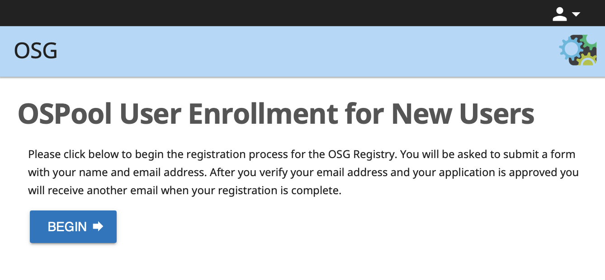
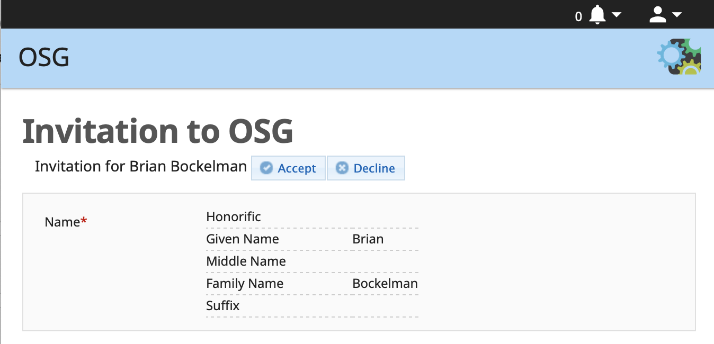

Registering for a new Open Science Pool Account
===============================================

The OSG access points at UW-Madison us the [COManage](https://www.internet2.edu/products-services/trust-identity/comanage/) identity management system
to register new users.
COManage uses the [InCommon federation](https://www.incommon.org/federation/), allowing users to register
with their institutional identities; there is no "OSPool password" that users must memorize

Starting the registration process
---------------------------------

You can start the application for a new account by following the registration process below:

1.  Visit <a target="_blank" href="https://osg-htc.org/new-ospool-user">the new OSPool user enrollment page</a>.

1.  You will be presented with a CILogon Single-Sign On page.
    Select your insitution and sign in with your insitutional credentials:

    

    Please use your institution's credentials as this simplifies the verification process; only
    select the Google or GitHub identity providers if your institution is not an option.

1.  After you have signed in, you will be presented with the self-signup form.
    Click the "BEGIN" button:

    

1.  Enter your name and email address.
    In most cases, your institution will provide defaults for your name and email address.
    If you prefer, you may override these values.

    If you have a GitHub account, please fill in your username.

    If you have already been working with an member to get the OSPool account, please
    select their name from the Sponsor drop-down; otherwise, leave it blank.

    Click the "SUBMIT" button:

    

Verifying Your Email Address
----------------------------

After submitting your registration application, you will receive an email from <registry@cilogon.org> to verify your email
address.
Follow the link in the email and click the "Accept" button to complete the verification:

Adding an SSH Key
-----------------

A SSH public key (see this [overview page](https://help.ubuntu.com/community/SSH/OpenSSH/Keys) for more information)
allows for easier SSH-based login to the access point.  After verifying your email address, you will be given an option
to upload a public key for your account.  If you are not ready to do that at this time, simply click "skip".

)

Meeting with a Facilitator
--------------------------

After verifying your email address (and optionally uploading the SSH key), a new support ticket will
be generated and we will contact you to arrange a meeting with a Facilitator for an introduction to
the access point and High Throughput Computing.  After this initial meeting, your account will be
finalized and you will be able to login to the system.

Getting Help
------------

For assistance or questions, please email the support team at <support@opensciencegrid.org>
